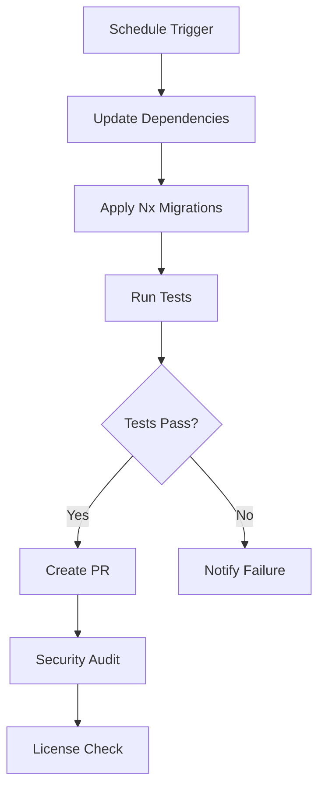

# CI/CD Documentation

This document outlines the Continuous Integration and Continuous Deployment (CI/CD) setup for the Saga SOA project.

## Overview

Our CI/CD pipeline consists of four main GitHub Actions workflows that ensure code quality, security, and reliable deployments:

1. **CI Workflow** (`.github/workflows/ci.yml`) - Main quality gates
2. **Deploy Workflow** (`.github/workflows/deploy.yml`) - Automated deployments
3. **Dependency Updates** (`.github/workflows/dependency-update.yml`) - Automated maintenance
4. **Performance Monitoring** (`.github/workflows/performance.yml`) - Performance tracking

## 🔄 CI Workflow

**Triggers**: Push to `main`/`develop`, Pull Requests
**Purpose**: Validate code quality and functionality

### Jobs

#### 1. Code Quality & Linting

- **Runtime**: ~2-3 minutes
- **Purpose**: Ensure code follows standards
- **Checks**:
  - Code formatting with Prettier
  - ESLint rules compliance
  - TypeScript type checking
- **Cache**: pnpm store for faster dependency installation

#### 2. Tests

- **Runtime**: ~3-5 minutes
- **Purpose**: Verify functionality with comprehensive testing
- **Services**: MongoDB 7.0, Redis 7-alpine
- **Coverage**: Generated and uploaded to Codecov
- **Tests**: 36+ unit and integration tests

#### 3. Build Verification

- **Runtime**: ~4-6 minutes
- **Purpose**: Ensure builds work across Node.js versions
- **Matrix**: Node.js 18, 20
- **Parallel**: 3 concurrent builds
- **Cache**: Build artifacts for deployment

#### 4. Docker Build Test

- **Runtime**: ~3-4 minutes
- **Purpose**: Verify containerization works
- **Features**:
  - Multi-architecture builds (AMD64, ARM64)
  - Layer caching for optimization
  - Health check validation

#### 5. Security Scan

- **Runtime**: ~2-3 minutes
- **Purpose**: Identify security vulnerabilities
- **Tools**:
  - `pnpm audit` for dependency vulnerabilities
  - Trivy scanner for filesystem vulnerabilities
  - SARIF upload to GitHub Security tab

### Example Status Checks

```bash
✅ Code Quality & Linting
✅ Tests (36 passing)
✅ Build Verification (Node 18, 20)
✅ Docker Build Test
✅ Security Scan
```

## 🚀 Deploy Workflow

**Triggers**:

- Push to `main` (staging)
- Tags `v*` (production)
- Manual dispatch

**Purpose**: Automated deployment to staging and production

### Jobs

#### 1. Build & Push Docker Image

- **Registry**: GitHub Container Registry (ghcr.io)
- **Tagging Strategy**:
  - `latest` for main branch
  - `sha-{commit}` for specific commits
  - `v{version}` for releases
- **Multi-platform**: AMD64 and ARM64
- **Cache**: GitHub Actions cache for layers

#### 2. Deploy to Staging

- **Environment**: staging
- **URL**: https://api-staging.saga-soa.com
- **Features**:
  - Kubernetes deployment
  - Rolling updates
  - Smoke tests post-deployment
- **Prerequisites**: Successful build

#### 3. Deploy to Production

- **Environment**: production
- **URL**: https://api.saga-soa.com
- **Triggers**: Git tags or manual approval
- **Features**:
  - Production smoke tests
  - Automatic GitHub release creation
  - Slack notifications on failure

### Deployment Commands

```bash
# Manual staging deployment
gh workflow run deploy.yml -f environment=staging

# Create production release
git tag v1.2.3
git push origin v1.2.3
```

## 🔄 Dependency Updates

**Triggers**:

- Weekly schedule (Sundays 2 AM UTC)
- Manual dispatch

**Purpose**: Keep dependencies current and secure

### Features

#### Automated Updates

- Updates all dependencies to latest compatible versions
- Applies Nx migrations automatically
- Runs tests to verify updates don't break functionality

#### Security Monitoring

- Comprehensive vulnerability scanning
- CodeQL analysis for code security
- License compliance checking

#### Pull Request Creation

- Automatic PR creation with update details
- Test results included
- Security audit results

### Update Process



## 📊 Performance Monitoring

**Triggers**:

- Push to `main`
- Pull Requests
- Daily schedule (3 AM UTC)
- Manual dispatch

**Purpose**: Monitor and prevent performance regressions

### Jobs

#### 1. Load Testing

- **Tool**: Artillery.js
- **Phases**:
  - Warm up: 5 req/sec for 30s
  - Ramp up: 10-50 req/sec for 60s
  - Sustained: 50 req/sec for 120s
  - Peak: 100 req/sec for 60s
- **Scenarios**:
  - Health checks (40% weight)
  - User CRUD operations (40% weight)
  - Read-heavy operations (20% weight)

#### 2. Bundle Analysis

- **Analyzes**: Build output size, dependency sizes
- **Reports**: Bundle size trends, largest dependencies
- **Threshold**: Alerts on significant size increases

#### 3. Memory & CPU Profiling

- **Tool**: Clinic.js
- **Duration**: 60 seconds under load
- **Metrics**: Memory usage, CPU utilization, event loop lag

#### 4. Regression Detection

- **Trigger**: Pull Requests only
- **Purpose**: Compare performance against baseline
- **Output**: Automatic PR comments with results

### Performance Thresholds

```yaml
Response Time:
  - P95 < 500ms
  - P99 < 1000ms
Memory Usage:
  - Heap < 512MB
  - RSS < 1GB
Error Rate:
  - < 0.1% for all endpoints
```

## 🔧 Configuration

### Required Secrets

#### CI/CD Secrets

```bash
GITHUB_TOKEN        # Automatically provided
CODECOV_TOKEN       # For test coverage upload
SLACK_WEBHOOK       # For deployment notifications
```

#### Deployment Secrets

```bash
KUBE_CONFIG_STAGING     # Base64-encoded kubeconfig for staging
KUBE_CONFIG_PRODUCTION  # Base64-encoded kubeconfig for production
```

### Environment Variables

#### Test Environment

```bash
NODE_ENV=test
MONGO_HOST=localhost
MONGO_PORT=27017
MONGO_DATABASE=saga-soa-test
MONGO_USERNAME=test
MONGO_PASSWORD=test
REDIS_HOST=localhost
REDIS_PORT=6379
```

## 📋 Monitoring & Alerts

### GitHub Checks

- All workflows appear as status checks on PRs
- Branch protection rules enforce passing checks
- Deployment environments require approvals

### Notifications

- **Slack**: Deployment failures and security alerts
- **Email**: Security vulnerability reports
- **GitHub**: PR comments with performance results

### Dashboards

- **Actions Tab**: Workflow run history and logs
- **Security Tab**: Vulnerability reports and CodeQL results
- **Insights**: Dependency graph and security advisories

## 🛠️ Local Development Commands

### Testing CI Commands Locally

```bash
# Run formatting check
pnpm format:check

# Run linting
pnpm ci:lint

# Run tests with coverage
pnpm ci:test

# Run type checking
pnpm ci:check-types

# Build all projects
pnpm ci:build

# Security audit
pnpm security:audit

# Docker build test
pnpm docker:build
pnpm docker:run
```

### Debugging Workflows

```bash
# Check workflow syntax
gh workflow list

# Run workflow manually
gh workflow run ci.yml

# View workflow logs
gh run view <run-id>

# Download artifacts
gh run download <run-id>
```

## 🔒 Security Best Practices

### Secrets Management

- Use GitHub Secrets for sensitive data
- Rotate secrets regularly
- Principle of least privilege for service accounts

### Dependency Security

- Automated vulnerability scanning
- License compliance checking
- Regular dependency updates

### Container Security

- Multi-stage builds for smaller images
- Non-root user execution
- Security scanning with Trivy

## 📈 Metrics & KPIs

### Build Metrics

- **Success Rate**: > 95%
- **Build Time**: < 10 minutes
- **Test Coverage**: > 80%

### Deployment Metrics

- **Deployment Frequency**: Daily (staging), Weekly (production)
- **Lead Time**: < 30 minutes from merge to staging
- **MTTR**: < 15 minutes for rollbacks

### Security Metrics

- **Vulnerability Remediation**: < 7 days for high/critical
- **Dependency Updates**: Weekly automated checks
- **Security Scan Coverage**: 100% of builds

## 🆘 Troubleshooting

### Common Issues

#### Failed Tests

```bash
# Check test logs in GitHub Actions
# Run tests locally with same environment
docker-compose up -d mongodb redis
pnpm ci:test
```

#### Failed Builds

```bash
# Check for TypeScript errors
pnpm ci:check-types

# Check for dependency issues
pnpm install --frozen-lockfile
```

#### Failed Deployments

```bash
# Check Kubernetes logs
kubectl logs -n saga-soa-staging deployment/saga-soa-api

# Verify image exists
docker pull ghcr.io/username/saga-soa/api:latest
```

### Getting Help

1. **Check Actions logs**: Detailed error messages and stack traces
2. **Review PR comments**: Automated feedback and suggestions
3. **Consult team**: Share workflow run URLs for collaborative debugging

## 🔄 Maintenance

### Weekly Tasks

- Review dependency update PRs
- Check security vulnerability reports
- Monitor performance trends

### Monthly Tasks

- Update workflow versions (actions/checkout, etc.)
- Review and optimize caching strategies
- Update documentation

### Quarterly Tasks

- Review and update security policies
- Optimize build and deployment times
- Evaluate new tools and practices
